# Neva — SDXL LoRA for Painterly Game Art

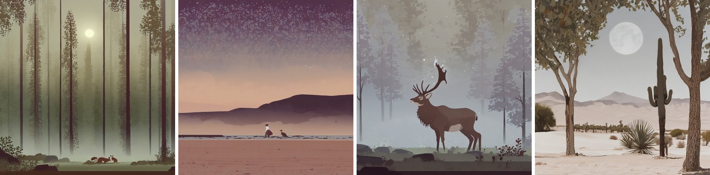

An SDXL LoRA trained on *Neva* / *Gris* (Nomada Studio) game art, with a paired
evaluation harness measuring whether the style actually transferred.
Kaggle, free tier, late March 2026.

**−27.96% style loss · 13/20 paired wins · −0.032 CLIP**

---

## Vanilla SDXL → Neva LoRA

Same prompt, same seed, same sampler. Only the style token differs.

| | Vanilla SDXL | Neva LoRA |
|---|---|---|
| misty forest at dawn | 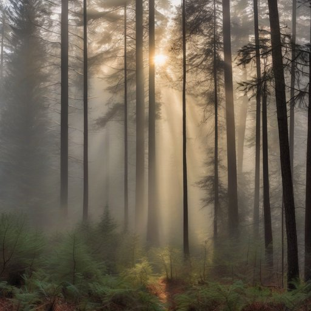 | 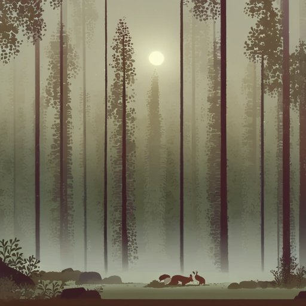 |
| pine forest, fresh snow at night | 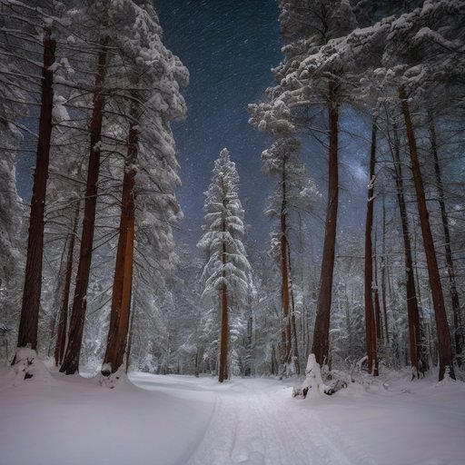 | 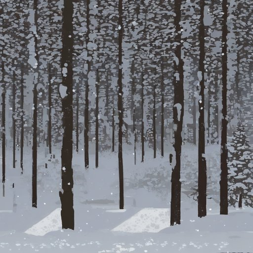 |
| solitary figure on a beach at sunset | 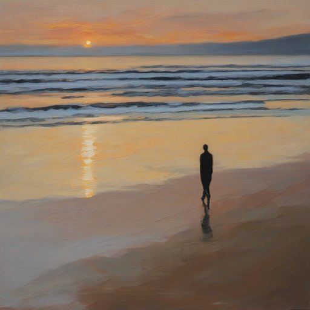 | 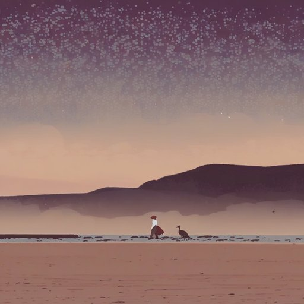 |
| white fox in a snowy landscape | 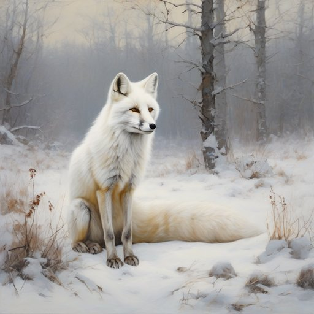 | 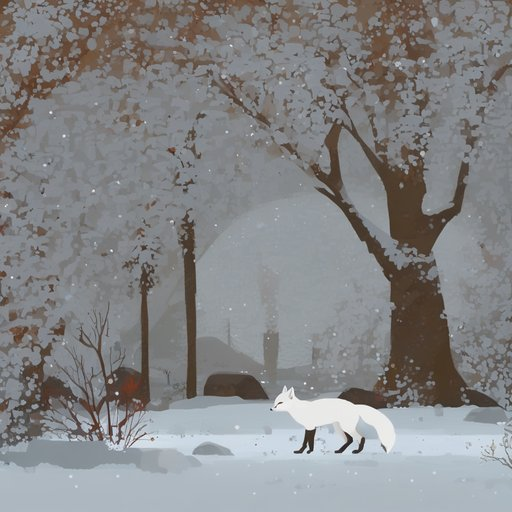 |
| stag with large antlers in morning mist | 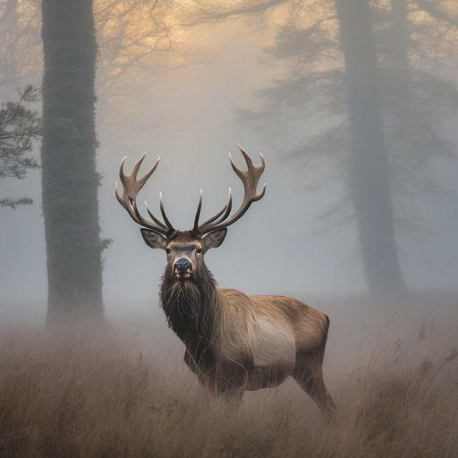 | 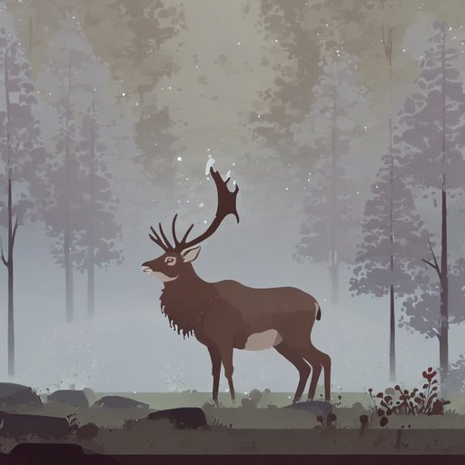 |
| fresh snow on rooftops | 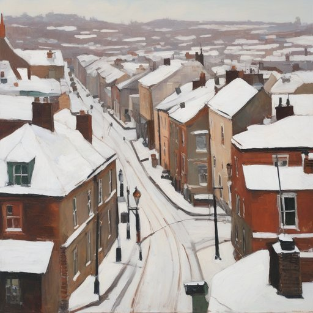 | 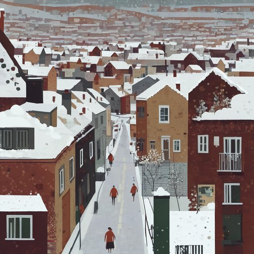 |
| floating island with a waterfall | 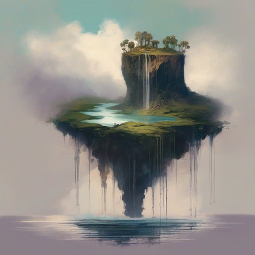 | 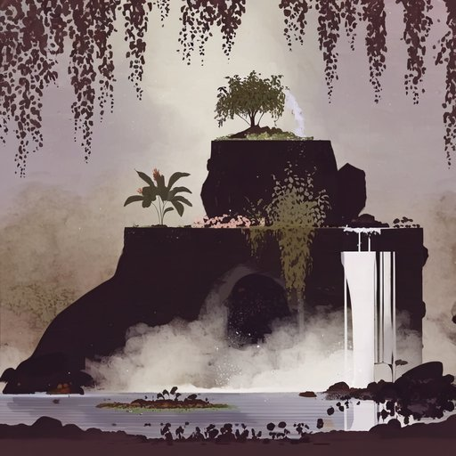 |
| a city on the back of a colossal turtle | 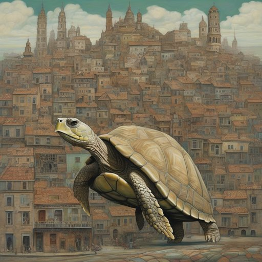 | 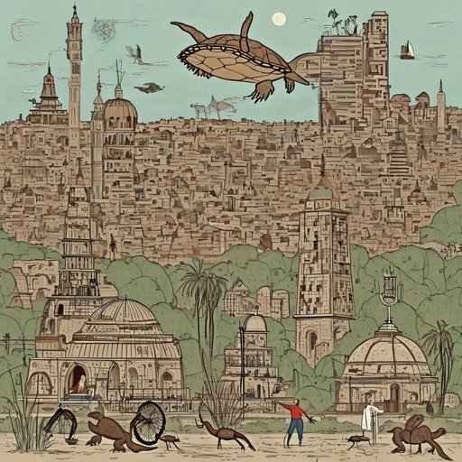 |
| ice crystals under a microscope | 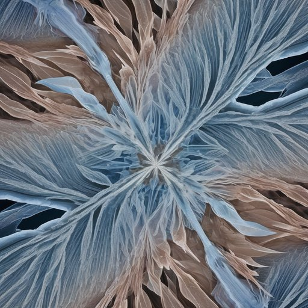 | 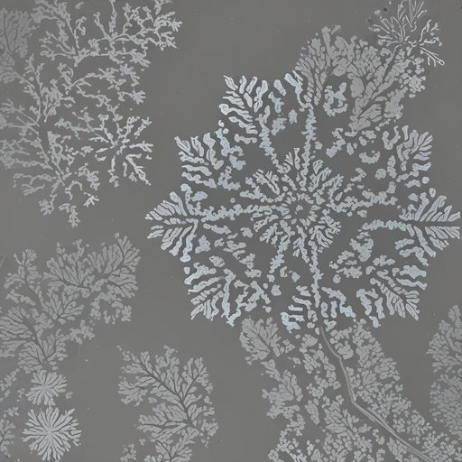 |
| scorching summer desert | 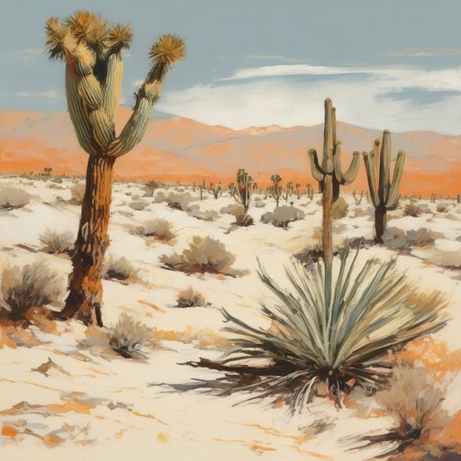 | 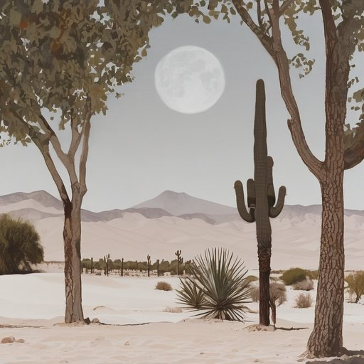 |

Flat color fields, compressed palette, hard silhouettes over soft washes — and the
composition prior of the source: the subject shrinks, the environment takes over.

The last two rows are the failure mode. Where a prompt needs one dominant foreground
subject, that same prior fights it and the environment wins.

---

## Training set

22 frames, 3420×1924, each with a long-form caption describing palette, technique, and
mood — narrow in subject, wide in palette, so the token binds to style rather than to
wolves and red cloaks.

<table>
<tr>
<td width="50%">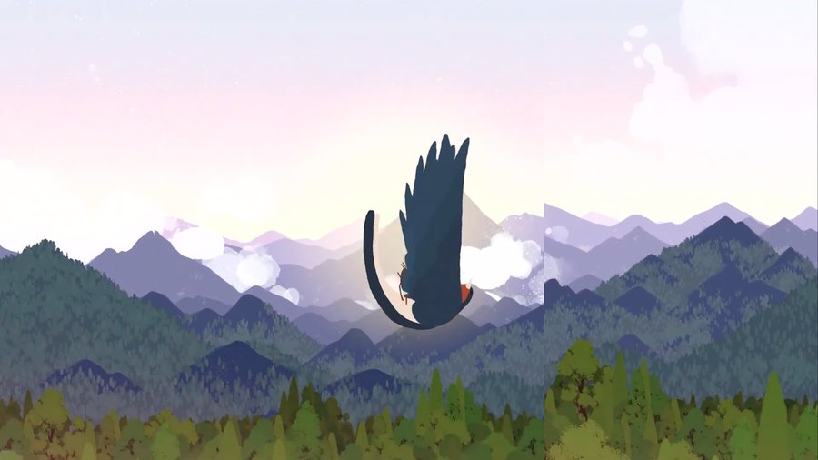</td>
<td width="50%">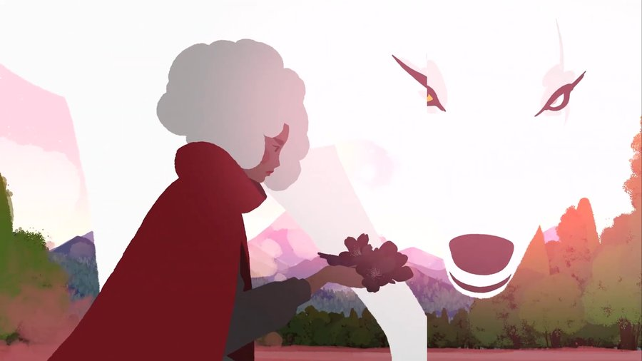</td>
</tr>
<tr>
<td width="50%">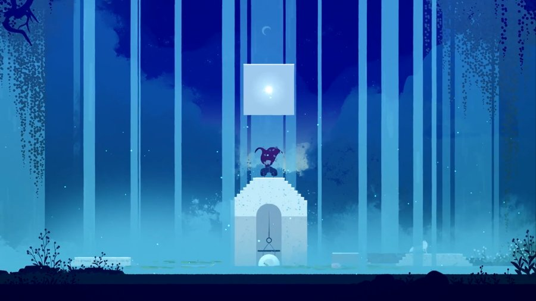</td>
<td width="50%">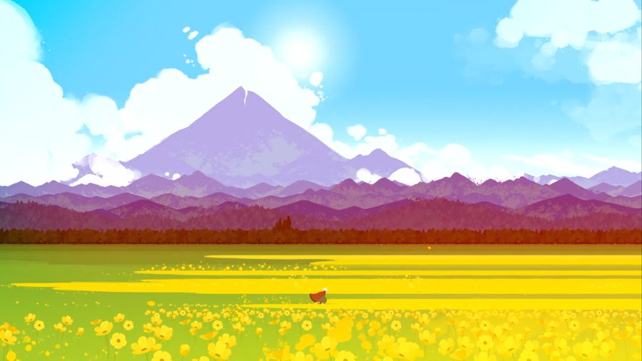</td>
</tr>
<tr>
<td colspan="2">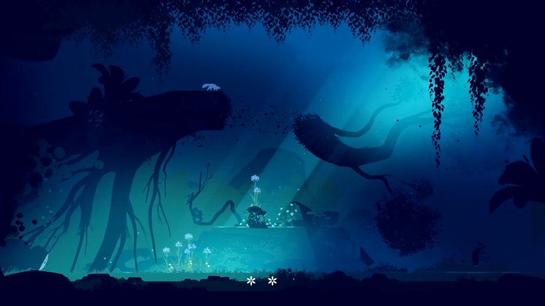</td>
</tr>
</table>

<sub>5 of 22 — full set in <a href="training_dataset/"><code>training_dataset/</code></a></sub>

---

## Results

n = 20 paired prompts · [`eval_results.json`](results/eval_outputs/eval_results.json)

| Metric | Vanilla | LoRA | Δ |
|---|---|---|---|
| **Gram style loss** ↓ | 4.436 ± 7.192 | **3.196** ± 3.340 | **−27.96%** |
| — paired wins ↑ | — | **13 / 20** | — |
| **CLIP** (content-only prompt) ↑ | **0.3561** | 0.3238 | **−0.0323** |
| **LPIPS** (vanilla ↔ LoRA) | — | 0.5688 | — |
| **FID** | — | — | skipped, n < 200 |

**Caveats.** Vanilla's style-loss std (7.19) exceeds its mean — the 28% is outlier-driven.
13/20 is p ≈ 0.26 under a sign test. What makes the effect credible is the variance
collapse (7.19 → 3.34: a far more *consistent* style) and the images above, not the
p-value.

The CLIP loss concentrates where the visuals fail: `characters_figures` −0.071,
`fantasy_surreal` −0.086, while `interior_scenes` (+0.007) and `weather_atmospheric`
(+0.017) improve. At 2 prompts per category, that's a hypothesis, not a finding.

FID is omitted deliberately — at n=20 it mostly encodes sample size.

**This is a smoke test, not a benchmark.** Enough to confirm the adapter loads, the style
transfers, and to surface a failure mode. Not enough for a confidence interval.

<details>
<summary>Making it publishable</summary>

- Raise `PER_CATEGORY` to 20 (200 images/arm) — enough for FID and per-category CLIP.
- Add a human or VLM preference test. No metric here measures "does this look like *Neva*";
  Gram loss measures texture and color statistics, which reward a model that merely matches
  the palette.
- Sweep LoRA scale (0.4–1.0) to find where style gain stops being worth the adherence loss.
  The CLIP regression is one point on an unplotted curve.
- Evaluate at 16:9. Training frames are all 3420×1924, generation is square, and the Gram
  comparison resizes both to 256×256 — aspect distortion is folded into every score.

</details>

---

<details>
<summary><b>Method</b></summary>

### Training — [`training-neva.ipynb`](training-neva.ipynb)

Pivotal tuning via the `diffusers` advanced DreamBooth LoRA script: a low-rank UNet
adapter plus two learned textual-inversion tokens (`<s0><s1>`) in both text encoders.

| | |
|---|---|
| Base / VAE | `stable-diffusion-xl-base-1.0` / `sdxl-vae-fp16-fix` |
| Script | `train_dreambooth_lora_sdxl_advanced.py` |
| LoRA rank | 8 |
| Optimizer | Prodigy, lr 1.0 (UNet + text encoder) |
| Text-encoder TI | on, `train_text_encoder_ti_frac=0.5` |
| Resolution | 1024, batch 1, grad accum 4, repeats 5 |
| SNR gamma | 5.0 |
| Precision | fp16, gradient checkpointing, xformers |
| Steps | 2000 configured, checkpoints every 500 |
| Seed | 42 |

Evaluated at the 1000-step checkpoint. Learned tokens export as an embeddings
`.safetensors`, loaded at inference via `load_textual_inversion` into both text encoders.

### Evaluation — [`testing-neva.ipynb`](testing-neva.ipynb)

Paired design: same 20 prompts, same seed per index (`42 + i`), same sampler, run through
vanilla SDXL and the LoRA. Only the style phrase differs — `a painterly {prompt}` vs.
`a <s0><s1> style {prompt}`. Prompts are drawn 2-per-category from a 500-prompt bank
spanning 10 content categories, so 20 images still cover the full content space.

20 prompts · 1024×1024 · 30 steps · CFG 7.0 · seed 42

Metrics:

1. **Gram style loss** *(primary)* — VGG19 Gram matrices at conv1_1…conv5_1 vs. the mean
   Gram of the training set, each layer normalized by its own reference energy.
2. **LPIPS** *(paired)* — how much the adapter changed the render. Magnitude, not direction.
3. **CLIP** — scored against the **content-only** prompt for both arms, so it measures
   adherence rather than style wording. (Scoring the LoRA arm against its own prompt would
   feed untrained `<s0><s1>` tokens into CLIP's text encoder.)
4. **FID** — computed only at n ≥ 200.

</details>

<details>
<summary><b>Layout &amp; reproducing</b></summary>

```
├── training-neva.ipynb           # LoRA + pivotal tuning training run
├── testing-neva.ipynb            # prompt bank, generation, evaluation
├── training_dataset/             # 22 PNG frames + .txt captions
├── assets/                       # downscaled images used in this README
└── results/eval_outputs/
    ├── eval_results.json         # all metrics
    ├── generation_meta.json      # prompts, seeds, sampler settings
    ├── vanilla/0000-0019.png     # 1024×1024 baseline renders
    └── lora/0000-0019.png        # 1024×1024 LoRA renders
```

Both notebooks target Kaggle and reference `/kaggle/input/...`; adjust `BASE_MODEL`,
`LORA_PATH`, `EMBED_PATH`, and `TRAINING_DATA_DIR` elsewhere.

```
pip install clean-fid lpips open_clip_torch torchvision diffusers transformers
```

`testing-neva.ipynb` runs top to bottom: cell 1 writes `prompts.py`, cell 2 generates both
image sets (resumable), cell 3 evaluates. The eval cell runs as a notebook cell or as
`python evaluate.py --skip-fid`.

</details>
